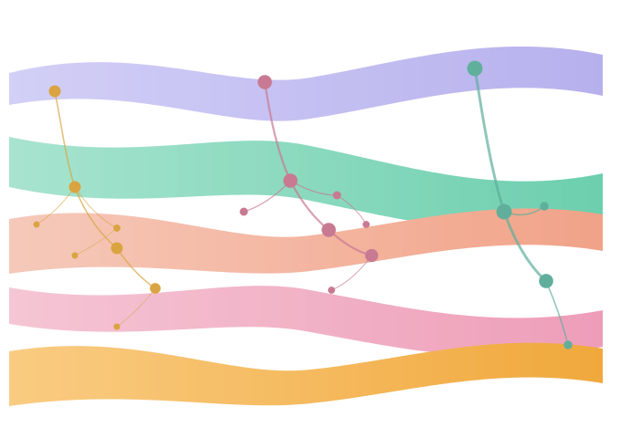

 

# Construction and Analysis of the *Moniliophthora roreri* pangenome

Code repository for a Master's thesis on the genomic diversity of *Moniliophthora roreri*, the causal agent of frosty pod rot in cacao. The project combines two graph-based pangenome construction tools, comparative genomics, functional annotation, and population-structure analyses across a dataset of 24 genome assemblies (5 chromosome-scale PacBio genomes and 19 additional Illumina genomes).

Two complementary pangenome-graph strategies are used throughout the repository and are treated as independent, non-redundant lines of evidence:

- **PGGB** (PanGenome Graph Builder) — reference-free, all-vs-all graph construction.
- **Minigraph-Cactus (MC)** — reference-guided, chromosome-scale graph construction.

## Repository structure

```
M.ror_code/
├── MC/                          # Minigraph-Cactus pangenome pipeline
├── PGGB/                        # PGGB pangenome pipeline
│   └── PGGB_24G/                #   24-genome extension of the PGGB pipeline
├── functional_annotation_PGGB/  # Protein functional annotation pipeline
└── population_structure/        # Population-genetics and geography analyses
    ├── community_geography/     #   Links PGGB communities/chromosomes to geography
    ├── geography_genetics/      #   Isolation-by-distance and spatial statistics
    └── population_structure_24G/#   24-genome extension of the population analysis
```

Scripts are organized as pairs of an orchestrating shell script (an SGE job script, recognizable by `#$` directives) and one or more Python/R scripts that perform the actual computation. Most shell scripts contain a `# =====` header block describing their purpose, inputs, outputs, and usage.

> **Note on paths:** many scripts hardcode absolute paths to the HPC cluster used during this thesis (e.g. `/Storage/data1/isabella.gallego/MAESTRIA/...`) and cluster-specific directives (`module load`, `#$ -q all.q`, SGE array flags). These need to be adapted before reuse on a different system.

---

## `MC/` — Minigraph-Cactus pipeline

Builds chromosome-scale pangenome graphs with [Cactus](https://github.com/ComparativeGenomicsToolkit/cactus) using a Singularity container.

| Script | Purpose |
|---|---|
| `create_seqfile_MC.sh` | Generates the `seqFile.txt` (sample name + FASTA path) required by Cactus. |
| `clean_fasta_headers_MC.sh` | Rewrites FASTA headers with a standardized, sequential naming scheme. |
| `group_chromosomes_MC.sh` | Groups per-strain chromosome FASTAs into one combined FASTA per syntenic chromosome group. |
| `run_chroms_pangenomes_MC.sh` | Orchestrator that chains, per chromosome group, a preparation job and a `cactus-pangenome` job (`-hold_jid`). |
| `run_global_pangenome_MC.sh` | Runs the full-genome Cactus pangenome workflow, producing GBZ, GFA, VCF, ODGI graphs, Giraffe indexes, and chromosome-level VG graphs. |
| `pangenome_stats_chroms_MC.sh` | Extracts summary statistics (variants, graph stats, functional classification, presence/absence) from the chromosome-level Cactus graphs. |

---

## `PGGB/` — PGGB pipeline

Builds reference-free pangenome graphs and derives variants, community structure, and population-genetics summaries using [PGGB](https://github.com/pangenome/pggb)

| Script | Purpose |
|---|---|
| `partition_PGGB.sh` | Runs `partition-before-pggb` on the input FASTA to split it into communities prior to graph construction. |
| `communities_PGGB.sh` | Runs PGGB on each partitioned community using a Singularity container. |
| `community_sequence_summary_PGGB.sh` | Lists sequence headers per community and combines them into one summary table. |
| `seqs_per_comm_PGGB.sh` | Extracts and summarizes the sequences assigned to each community. |
| `VCF_generation_comms_PGGB.sh` / `generate_per_reference_vcfs_PGGB.py` | Converts each community's GFA to VG/XG and runs `vg deconstruct`, producing one VCF either per community (reference = B3) or one VCF per genome used as reference path (for reference-bias analysis). |
| `run_per_reference_vcfs_local_PGGB.sh` | Local (non-cluster) wrapper for `generate_per_reference_vcfs_PGGB.py`. |
| `classify_vars_comms_PGGB.sh` / `classify_variants_batch_PGGB.py` | Classifies variants per community from the VCFs (SGE job + batch classification script). |
| `annotate_variants_PGGB.sh` / `annotate_variants_by_region_PGGB.py` | Intersects variants with a GFF3 (via `bedtools`) to classify them by genomic region (CDS > UTR5/UTR3 > exon > intron > intergenic), as an SGE array job (one task per community). |
| `build_master_region_comparison_PGGB.py` | Merges all per-community/per-reference region-distribution tables into one master comparison table (counts and percentages). |
| `ref_bias_plots_PGGB.py` | Generates the reference-bias figures (grouped bar plot, normalized heatmap, stacked bar plot, and a mean/range-of-variation summary panel) from the per-reference comparison table. |
| `pangenome_stats_PGGB.sh` | Extracts pangenome summary statistics (via `bcftools`/`bedtools`) for the PacBio-based PGGB graphs. |
| `pca_global_PGGB.R` | Global PCA across all PGGB communities (population structure among the five PacBio genomes). |
| `pca_per_community_PGGB.R` | One PCA per PGGB community. |
| `pca_snps_mds_PGGB.R` | Global SNP-only PCA, plus an MDS on Jaccard distance across all variant types. |

### `PGGB/PGGB_24G/` — 24-genome extension

Extends the PGGB pipeline above to the full 24-genome dataset, focused on the chromosome-scale communities.

| Script | Purpose |
|---|---|
| `run_community_sequence_inventory_PGGB.sh` / `build_community_sequence_tables_PGGB.py` | Reconstructs community composition from `partition-before-pggb` FASTA outputs (PanSN headers), producing an inventory, a community summary, a PacBio-chromosome-to-community map, and validation tables. |
| `VCF_generation_24G_chromosome_communities_PGGB.sh` | Generates VCFs (GFA → VG → XG → `vg deconstruct`) only for the communities corresponding to the 11 chromosome-scale syntenic groups (Group10 spans community.0 and community.1). |
| `verify_vcfs_PGGB.sh` | Verifies the generated VCFs and builds a reference/community summary table (`vcf_reference_chromosome_communities.tsv`). |
| `run_pacbio_community_figure_PGGB.sh` / `plot_pacbio_community_chromosome_map_PGGB.R` | Publication-ready two-panel figure linking syntenic groups and ungrouped PacBio sequences to PGGB communities. |

---

## `functional_annotation_PGGB/` — Functional annotation

A numbered pipeline (00–08) that annotates the predicted proteome.

| Step | Script | Purpose |
|---|---|---|
| 00 | `00_validate_proteome_PGGB.py` | Validates and QCs the input proteome FASTA. |
| 01 | `01_run_interproscan6_PGGB.sge.sh` | Runs InterProScan6 via Nextflow/Singularity. |
| 02 | `02_setup_eggnog_mapper_PGGB.sh`, `02_run_eggnog_mapper_PGGB.sge.sh` | Sets up and runs eggNOG-mapper (DIAMOND, Fungi taxonomic scope). |
| 03 | `03_run_hmmscan_pfam_optional_PGGB.sge.sh` | Optional Pfam-A domain scan with `hmmscan`. |
| 04 | `04_run_signalp6_PGGB.sge.sh` | Signal-peptide prediction with SignalP6. |
| 05 | `05_deeptmhmm_instructions_PGGB.md`, `05_parse_deeptmhmm_PGGB.py` | Instructions for running DeepTMHMM externally, plus a parser that normalizes its 3-line output. |
| 06 | `06_prepare_secretome_PGGB.py` | Combines SignalP6 + DeepTMHMM results to define the secretome candidate set. |
| 07 | `07_run_effectorp3_PGGB.sge.sh` | Effector prediction on the secretome with EffectorP3. |
| 08 | `08_setup_dbcan_PGGB.sh`, `08_run_dbcan_PGGB.sge.sh` | Sets up and runs CAZyme annotation with `run_dbcan`. |

---

## `population_structure/` — Population genetics and geography

Builds SNP matrices from the pangenome VCFs (PGGB and/or Cactus) and performs population-structure and geography-versus-genetics analyses.

| Script | Purpose |
|---|---|
| `build_snp_matrix.py` | Builds a unified binary SNP matrix from partitioned PGGB or Cactus VCFs (0 = ALT absent, 1 = ALT present, NA = missing; multiallelic sites decomposed; reference sample B3 reconstructed as 0). |
| `analyze_population_structure.R` | PCA, Euclidean/Hamming distances, distance heatmaps, and UPGMA dendrograms from an imputed SNP matrix (color = geographic region). |
| `compare_pggb_cactus_pca.R` | Faceted PGGB-vs-Cactus PCA comparison. |
| `sample_balanced_snps.py` | Draws a partition-balanced SNP subset (equal SNPs per PGGB community / Cactus chromosome group). |
| `run_balanced_pca_seed.py` | Single-replicate partition-balanced PCA (one random seed) for both PGGB and Cactus. |
| `run_balanced_pca_robustness_array.sh` / `submit_balanced_pca_robustness.sh` | 100-replicate SGE array job (and its submission wrapper) for the balanced-PCA robustness analysis. |
| `summarize_balanced_pca_robustness.R` | Aligns replicates to the full-SNP PCA via Procrustes and summarizes robustness (residuals, Pearson/Spearman correlation, coordinate intervals). |
| `run_population_structure_pipeline.sh`, `run_balanced_pca_pipeline.sh` and matching `*_job.sh` | End-to-end SGE orchestration wrappers for the analyses above. |

### `population_structure/population_structure_24G/` — 24-genome extension

Re-runs the population-structure analysis on the full 24-genome dataset under two community profiles: **`all_11`** (all chromosome-associated communities) and **`conservative_9`** (excludes community.0 and community.1).

- `build_24G_snp_matrix.py` — builds the binary SNP matrix per profile.
- `analyze_24G_population_structure.R` — PCA/distance/clustering for all 24 genomes, and separately for the Illumina-only and PacBio-only subsets (color = country, shape = sequencing technology).
- `run_24G_population_pipeline.sh` / `run_24G_population_job.sh` — pipeline driver and SGE job wrapper.

### `population_structure/geography_genetics/` — Isolation by distance

Relates PGGB genetic distances to sample geography.

- `validate_coordinates.py` — validates sample coordinates and coordinate-precision metadata.
- `build_and_analyze_spatial_genetics.R` — builds geographic distance matrices and pairwise tables; runs Mantel tests, MRM models, and descriptive regressions; ranks discrepant sample pairs.
- `make_spatial_genetic_figures.R` — sampling maps, isolation-by-distance scatter plots, nearest-neighbor and similarity-network maps, and heatmaps.
- `install_required_R_packages.R` — installs the R dependencies (`geosphere`, `vegan`, `ecodist`, `sf`, `rnaturalearth`, etc.).
- `final_corrections/` — a later, corrected pass over the analysis above: ordered distance classes, formal model residuals, standardized MRM output, explicit handling of zero-km pairs, a high-precision coordinate subset (`recalculate_spatial_statistics_final.R`, `make_spatial_genetic_figures_final.R`), a community-profile audit (`audit_community_profiles.py`), and a consolidated master summary (`build_pipeline_master_summary.py`).

### `population_structure/community_geography/` — Community-level geography

Asks which genomic regions (PGGB communities / chromosomes) explain the geographic structure of *M. roreri*.

- `validate_community_chromosome_map.py` — validates the community-to-chromosome mapping.
- `per_community_spatial_analysis.R` — Mantel, MRM, PCA, and distance-decay statistics computed independently for every community.
- `rank_communities.py` — ranks communities by MRM geographic effect size, model R², and Mantel r (with an exploratory composite score).
- `plot_community_geographic_contribution.R` / `_v2.R` — four-panel publication figure (community ranking, Mantel/MRM heatmap, chromosome ideogram, SNP-contribution vs. effect-size) for both the `all11` and `conservative9` profiles; `run_community_geography_figures_v2.sh` regenerates figures without recomputing statistics.
- `annotate_community_snps.py` — maps retained SNPs to genes/genomic regions via a GFF3.
- `enrich_top_community_genes.py` — exploratory Fisher-exact enrichment (GO, Pfam, CAZyme) among genes hit by SNPs in the top geographic communities, plus a secretome/effector summary. *(Requires a curated gene-annotation table — see `gene_function_annotations_template.tsv`.)*

---

## Requirements

Software used across the pipelines (versions as pinned in the scripts where applicable):

- **Pangenome graphs:** PGGB (`partition-before-pggb`, `pggb`), Cactus (`cactus-pangenome`), `vg`, `odgi`
- **Variant/graph tools:** `bcftools` 1.22, `bedtools` 2.28.0, `samtools` 1.22
- **Functional annotation:** InterProScan6, eggNOG-mapper 2.1.9, HMMER 3.4 (Pfam-A), SignalP6, DeepTMHMM, EffectorP3, `run_dbcan`
- **Python** ≥3.11 with `pandas`, `numpy`, `scipy`
- **R** ≥4.5 with `ggplot2`, `ggrepel`, `vcfR`, `scales`, `gridExtra`, `geosphere`, `vegan`, `ecodist`, `sf`, `rnaturalearth`, `rnaturalearthdata`, `ggspatial`
- Scripts are written for an **SGE** HPC cluster (`qsub`, `#$` directives, `module load`) with **Singularity/Apptainer** for containerized tools (PGGB, Cactus)

## Reproducing an analysis

Because paths and cluster directives are specific to the original HPC environment, reproducing any given analysis generally means:

1. Open the relevant orchestrator script (the one with a `# ===== <name> =====` header and a `Usage:` line).
2. Update the hardcoded paths (input FASTA/VCF locations, output base directory, environment/database paths) to local environment.
3. Adjust or remove the SGE directives (`#$ -q`, `#$ -pe smp`, `module load ...`) if not running on SGE.
4. Run the script directly (`bash script.sh`) or submit it (`qsub script.sh`), following the `Usage:` comment at the top of the file.

## Project context

This repository accompanies a Master's thesis on the genomic diversity of *Moniliophthora roreri*, combining gene-content and graph-based pangenomics, comparative genomics, synteny analysis, variant analysis, functional annotation, and geographic/genetic relationships across 24 assemblies (5 PacBio + 19 Illumina). PGGB and Minigraph-Cactus are treated as complementary, non-interchangeable representations of the same underlying pangenome; absolute variant counts and variant density are kept as distinct metrics throughout the analyses.

---
 
## Author
 
**Isabella Gallego Rendón**, MSc. Bioinformatics
Center of Nuclear Energy for Agriculture (CENA), University of São Paulo
 
[](mailto:igallegor@usp.br)
[](https://www.linkedin.com/in/igallegor)
 
## Citation
 
If you use this pipeline, please cite the repository:
 
```
Gallego-Rendon, I. (2026). M.ror_PanG: Construction and Analysis of the Moniliophthora roreri pangenome [Computer software]. GitHub.
https://github.com/igallegor97/M.ror_code
```
